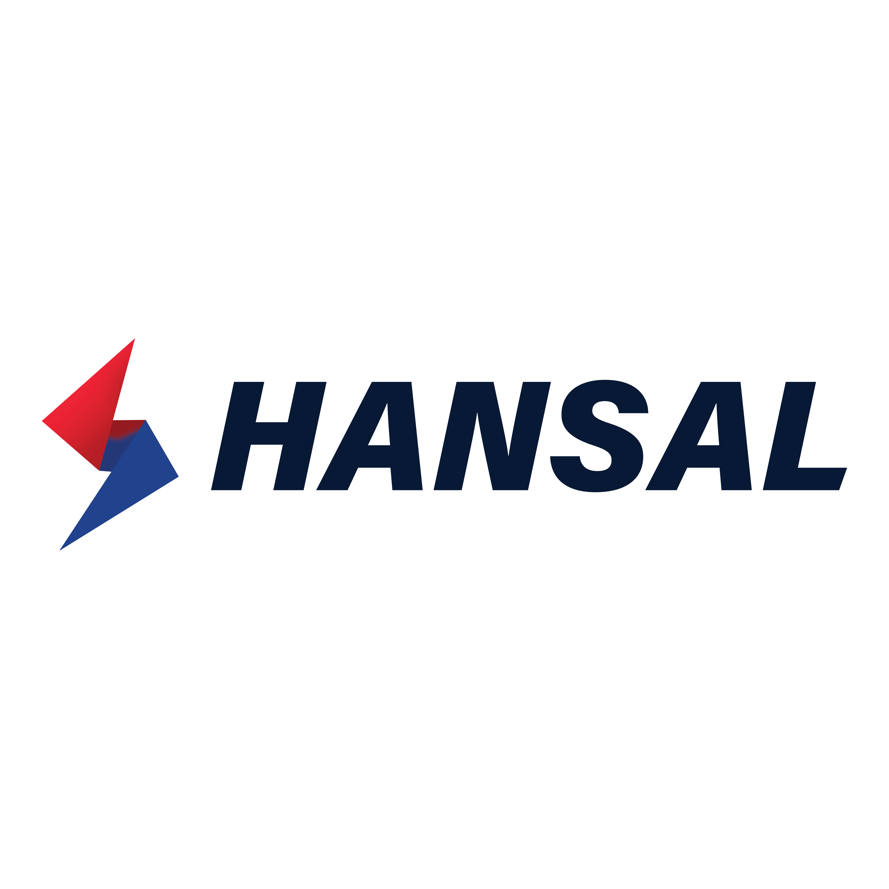

## HANSAL: Hybrid AI for Next-gen: Sustainable, Affordable, and Lightweight
  

## Introduction

Recent advances in AI demand significant computational resources, which presents cost and sustainability barriers for small and medium-sized enterprises (SMEs).

Project HANSAL addresses these challenges, offering a benchmarking framework that balances accuracy, runtime, cost, and energy consumption for a DL solution.

This project is a benchmarking framework that is also featured in the Master's Thesis @ HAW Kiel:

**Study on Proof-of-Concept Benchmarking Framework for Resource-Optimised AI: Efficient Performance, Cost, and Sustainability for Small-Medium Enterprises (SMEs)**

## Project Scope
* Exploration and testing of AI benchmarking tools suitable for SMEs.
* Evaluation of currently available hardware architectures (GPUs, AI accelerators) for affordability and scalability.
* Implementation of a lightweight benchmarking workflow using open-source libraries (e.g. `CodeCarbon`, `Zeus`, `Perun`).
* Creation of an open-source repository for replicable benchmarking experiments, supporting business case-specific needs.

## Project Objectives
* Provide SMEs with the tools and know-how to adopt AI cost-efficiently and sustainably.
* Serve as both an academic contribution and an actionable industry guide.
* Structure data pipelines for transparent performance, allowing resource optimization tailored to SMEs.

